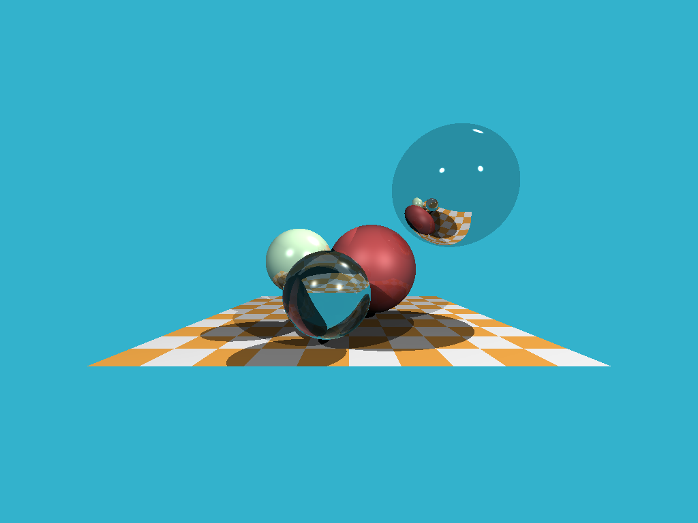

# tiny-raytrace-rs

This is an implementation of [ssloy/tinyraytracer](https://github.com/ssloy/tinyraytracer/wiki/Part-1:-understandable-raytracing), in Rust.
It doesn't follow the same code style but each step should be roughly equal. Also I used two famous libraries, [image](https://crates.io/crates/image) for creating the image and writing it on disk, and, [glam](https://crates.io/crates/glam) for vector algebra.

- [Step 1](https://github.com/ekarademir/tiny-raytracer/commit/82e83439afb5dd4d563bbc020c3e7c575f8e9ae3) Write an image to disk
- Step 2, [Commit 1](https://github.com/ekarademir/tiny-raytracer/commit/d769b50c896bed80fa0bb9292595467dce645313), [Commit 2](https://github.com/ekarademir/tiny-raytracer/commit/e7703564763a3f73b5b980e88b5aeccb1737cdd0), [Commit 3](https://github.com/ekarademir/tiny-raytracer/commit/ee35fe58a24058bd7a83dfca3828c88501c781be), The crucial one: ray tracing
- [Step 3](https://github.com/ekarademir/tiny-raytracer/commit/4d204df5502100242836f1a2b4df502e925e7413) Add more spheres
- [Step 4](https://github.com/ekarademir/tiny-raytracer/commit/099934cfe6f8bca5a2ca920f26705481d25f3c62) Lighting
- [Step 5](https://github.com/ekarademir/tiny-raytracer/commit/ee280713ea072a4910be8bddb7a21291840fb126) Specular lighting
- [Step 6](https://github.com/ekarademir/tiny-raytrace-rs/commit/afd737103018ef2e69c81e4e8087b47eede64d9b) Shadows
- [Step 7](https://github.com/ekarademir/tiny-raytrace-rs/commit/1d57006c251a0977a8a5e62d4497707e1b5ac7d8) Reflections
- [Step 8](https://github.com/ekarademir/tiny-raytrace-rs/commit/43fef840a4835d9f9349876a6846a150294a5616) Refractions
- [Step 9](https://github.com/ekarademir/tiny-raytrace-rs/commit/0fc8d93c5f9129781e179c5cd534d33ced4049eb) Beyond the spheres

I stopped at Step 9, after which there is a take home assignment, but I think I got quite a bit of insight already.

Here is the final produced image:

